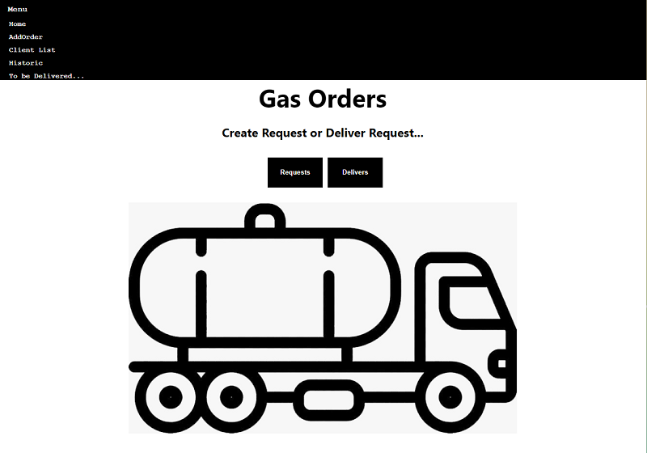

Gas Delivers

Live Link: https://gasorders.now.sh/

Summary:

In this application the user creates the gas orders, these orders are stored in the delivery area, the distributor when changing the order to deliver the order goes to the history and also creates a customer record.

Motivation:

this app will be used in the company I'm working with in order to improve the distribution process.

Screenshots:

Home Page

This is the page we can add an Order.

This is the List of Delivers

This is a Deliver where the distributor can check if it´s done

After the whole process creates a delivery history

The technology used:

-JavaScript,
-React,
-JSX,
-CSS,
-JEST for testing.
